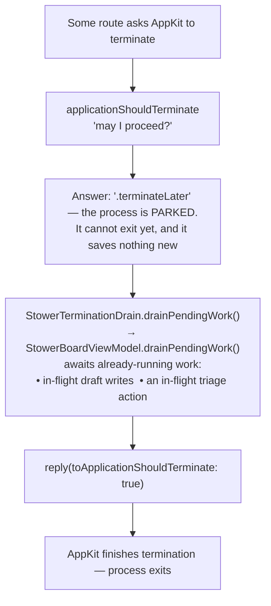
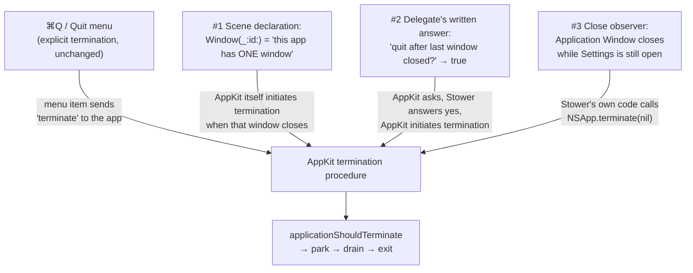

# How Stower quits

A plain-language map of every way the Stower process can end, what happens between "quit
requested" and "process exits," and why no route is allowed to skip that middle part. Written
for a human building intuition, not for the compiler — exact contracts live in
`Docs/MacAppContract.md` §10; this doc explains the flow and relationships.

## The one idea everything else hangs off

**Nobody quits the app directly.** Every route — a menu item, a window closing, Stower's own
code — merely *asks* AppKit (macOS's application framework) to terminate. AppKit's termination
procedure then consults a checkpoint before honoring the request:
`ApplicationLifecycleDelegate.applicationShouldTerminate` in
`StowerMac/StowerMacMAS/StowerApplication.swift`. Because the checkpoint is part of AppKit's
own quit sequence, no route can route around it. That is the design's safety: the drain does
not need to know *why* the app is quitting, because it always runs first.

**The invariant, in one sentence:** one gate for all routes, and the gate's reach must not
depend on the window being alive — every quit passes through `applicationShouldTerminate`, and
the drain it runs must hold its target strongly so a closed window can never hollow it out.

## What the checkpoint does: park, drain, release

**The drain is a drain, not a save.** Draft text reaches SQLite on every keystroke
(`setDraft` → `enqueueDraftWrite` → `draftStore.upsert`), so by the time a quit is requested
the data is already on disk or milliseconds from it. `drainPendingWork()` writes nothing — it
awaits the writes (and any triage action) that were already running, which is why the park
lasts milliseconds, not seconds. It finishes sentences, it does not write the essay.

## The routes into the checkpoint

### As built

**Explicit termination** — ⌘Q, the app menu's Quit item, or anything else that sends AppKit
a terminate request.

**Closing the Application Window — also a quit, always.** Three mechanisms make it so, and
they are deliberately redundant; all of them still end at the same checkpoint. The runtime
behavior was observed by hand (2026-08-24 and 2026-09-10): the app quits, Settings closes
with it, nothing strands the process windowless.

How to hold the three in your head:

- **#1 and #2 are the same rule stated twice** — "closing the last window quits." #1 is
  *implied* by declaring the window single-instance (`Window(_:id:)` instead of the
  multi-window group scene);
  the platform does the quitting. #2 writes the intent into Stower's own source
  (`applicationShouldTerminateAfterLastWindowClosed` returning `true` on
  `ApplicationLifecycleDelegate`), so the behavior is explicit, greppable, and guarded rather
  than resting on a scene type's implicit semantics.
- **#3 exists for the one case the rule misses.** Settings (⌘,) is also an `NSWindow`, so
  closing the Application Window while Settings is open is *not* a last-window close — #1 and
  #2 stay silent. The observer subscribes to window-close notifications, recognizes the
  Application Window, and requests termination itself. Settings then closes as a consequence
  of quitting, which is safe because Settings holds no unsaved state (its one toggle writes
  through the instant it flips).

## The hazard on the drain path — found and fixed

The drain reaches the board through a closure registered by
`StowerApplicationWindowContentView` (`registerDrain`). While grounding this doc, the planned
close-to-quit routes exposed a latent regression: the closure originally captured the board
model **weakly** — a reference that does not keep the model alive. With every quit beginning
at the window open (⌘Q) that was harmless, but the close-to-quit routes tear the window's
view tree down *first*, which would deallocate the model and turn the drain into a silent
no-op: the process exits instantly, possibly mid-write, and looks identical to a correct
quit. The capture is now **strong** (`StowerTerminationDrain` holds its registered closure,
whose target outlives any window teardown), proven by
`StowerApplicationWindowContentViewDrainTests` (I-DrainOutlivesWindow — it fails against the
weak capture and passes against the strong one) and locked by the `6g` precheck guard.

## What this doc is not

- Not the contract: `Docs/MacAppContract.md` §10 is canonical for scene/lifecycle behavior.
- Not the observation log: the runtime behavior (window identifier, Settings-open quit,
  Dock-icon restore, Window-menu entry) was verified by hand — the outline's Phase 1
  checklist — with results recorded in the task's structure outline under
  `tmp/add-window-menu-to-reopen-main-application-window/`.
